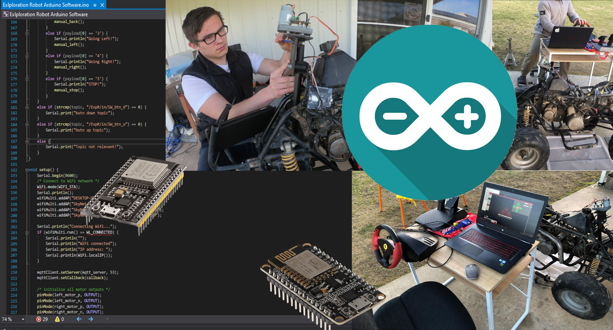

# Automated Quad Bike: Arduino Software Solution
### School Assessed Task: Systems Engineering
#### ------------------------------------------------------------------------------
#### Note:
##### Whilst working on this project I will commit all changes into GitHub in order to keep track of my work and for authenticity purposes.
##### I will also create releases at certain stages which you can download in the releases page. I will only ever create releases when the program is in a working condition and I will only do this when major changes have been made.
#### ------------------------------------------------------------------------------

## Table of contents
* [General info](#general-info)
* [Technologies](#technologies)
* [Setup](#setup)

## General info
This project is developed by Liam Price in order to pass the Systems Engineering SAT at BSSC. The overall function of this software is to be uploaded onto Arduino based boards to control and drive the systems involved in my Systems Engineering Project "Automated Quad Bike" or AQB for short. You may use this software and adapt it for your own IoT project if you like.
## Technologies
Project is created with:
* Visual Studio + Arduino Extension
* PubSub Client library @ https://github.com/knolleary/pubsubclient/
* Pretty much any IoT enabled development board such as ESP-32 & ESP8266
	
## Setup
To run this project, download it:

```
Go To Releases
Download as ZIP according to the board you are using
If the release readme requires you to make changes to the code such as entering network / MQTT credentials, do that, or it ain't gonna work.
Upload the main .ino file to your Arduino Board
Alternatively download the latest commit from any branch, note that it may not be stable or functional.
```
