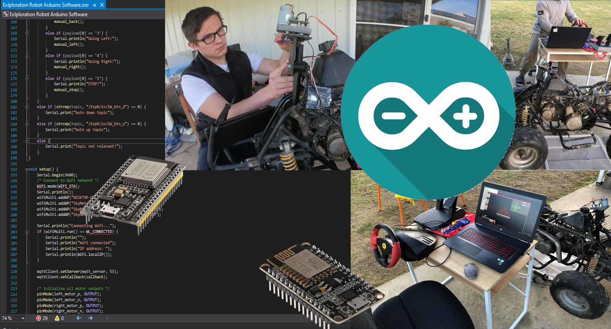

# Automated Quad Bike: Arduino Software Solution
### School Assessed Task: Systems Engineering


## Table of contents
* [General info](#general-info)
* [Technologies](#technologies)
* [Setup](#setup)

## General info
This project is developed by Liam Price in order to pass the Systems Engineering School Assesed Task at BSSC. The overall function of this software is to be uploaded onto Arduino based boards (esp32) to control and drive my Systems Engineering Project "Automated Quad Bike" or AQB for short. You may use this software and adapt it for your own IoT project if you like. You can view the control panel I built for it here:
https://github.com/LeehamElectronics/AQB-Control-Panel

Here is a YouTube video with a basic demonstration of the system: https://www.youtube.com/watch?v=ic49dhoIEfM

## Technologies
Project is created with:
* Visual Studio + Arduino Extension (Visual Micro)
* PubSub Client library @ https://github.com/knolleary/pubsubclient/
* Pretty much any IoT enabled development board such as ESP-32 & ESP8266
	
## Setup
To run this project, download it:

```
Go To Releases
Download as ZIP according to the board you are using
If the release readme requires you to make changes to the code such as entering network / MQTT credentials, do that, or it ain't gonna work.
Upload the main .ino file to your Arduino Board
Alternatively download the latest commit from any branch, note that it may not be stable or functional.
```
